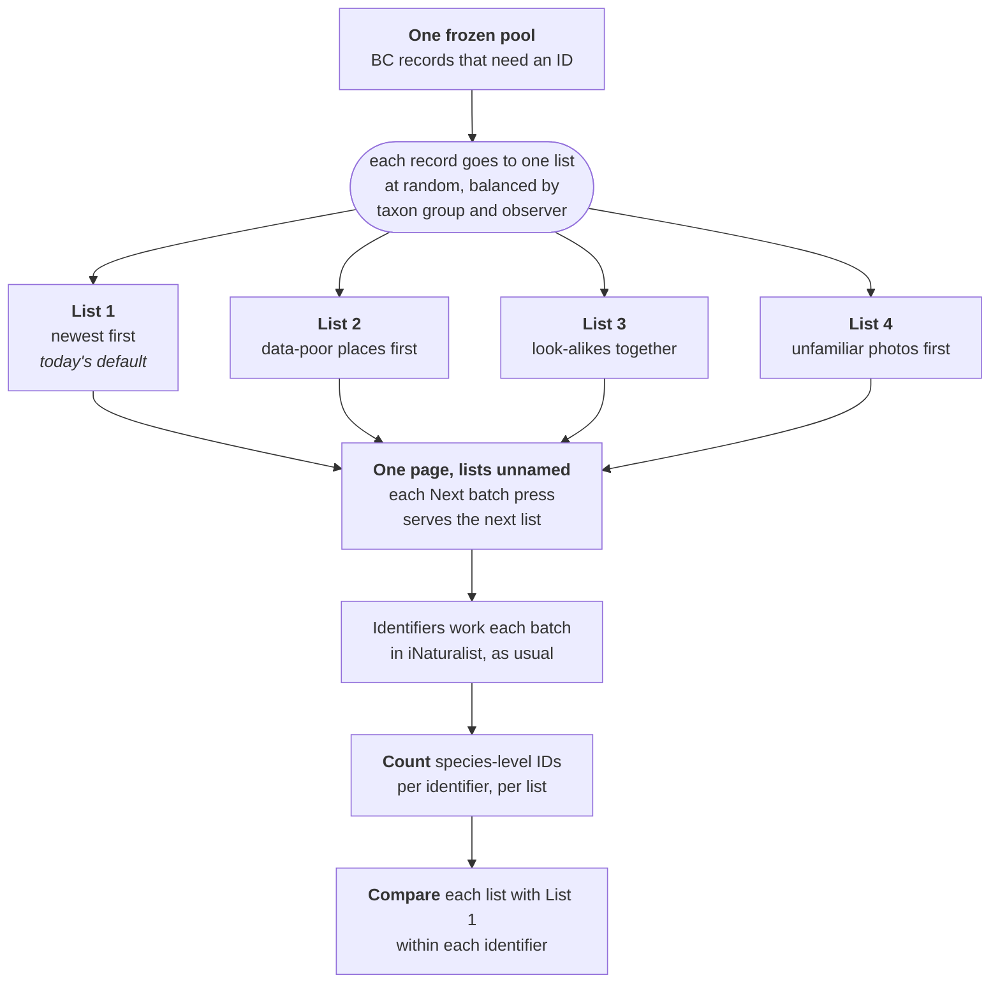

# what-to-id

Which iNaturalist records should a British Columbia identification blitz work on? what-to-id builds the batches, serves them as blinded lists of iNaturalist Identify links, and reads the outcome back 30 days later to see which way of composing batches got more records identified.

Companion to [where-to-blitz](https://github.com/PollockLab/where-to-blitz), which answers where to go and record. Both serve Blitz the Gap.

## The experiment in one picture



Each record sits on exactly one list. The split gives every list a like mix of taxon groups and of the observers who posted the records, so the lists differ only in the order they show their records. That order is the one thing under test.

**Every identifier works every list.** A few identifiers make most of the IDs. If each identifier kept one list, the list that drew the busiest identifier would win whatever its order. So each browser draws its own random cycle of the four lists once, and every press of Next batch takes the next list in that cycle:

| | Their cycle | Press 1 | Press 2 | Press 3 | Press 4 | Press 5 | Press 6 | Over the blitz |
|---|---|---|---|---|---|---|---|---|
| Identifier who does 40 batches | 3 → 1 → 4 → 2 | 3 | 1 | 4 | 2 | 3 | 1 | 10 batches from each list |
| Identifier who does 4 batches | 2 → 4 → 1 → 3 | 2 | 4 | 1 | 3 | | | 1 batch from each list |

IDs are credited to iNaturalist accounts and each record's list is fixed, so a second device only adds a second balanced cycle. Each identifier is then compared with themself: their IDs on List 2 against their IDs on List 1, and so on. A busy identifier adds the same effort to every list, so their skill cancels out. `python -m what_to_id.power` simulates both designs.

| | One list per identifier | Every identifier works every list |
|---|---|---|
| A busy identifier's effort goes to | one list | all lists, equally |
| A list scores high because of | who landed on it | its order |
| Compared unit | list totals | each identifier with themself |

## How it works

1. **Pull.** Freeze the BC pool of needs-ID records with a photo, observed since a start date and created before a freeze date, so a rerun reproduces the same pool.
2. **Assign.** Each record goes to one arm at random, balanced within taxon group and observer.
3. **Compose.** Each arm orders its records into batches:
   - `recency`: newest first. This is what an identifier gets from iNaturalist today.
   - `gap_first`: records from data-poor places first, using the where-to-blitz cell scores.
   - `similarity`: look-alike photos together, from BioCLIP 2.5 image embeddings.
   - `novelty`: photos least like any Research Grade BC photo of the same group first.
4. **Serve.** A static page shows lists labelled A to D, each a stack of Identify links. The arm behind each letter is recorded only in the build's `manifest.json`, never on the page. By default each identifier takes one list; `--design rotation` serves the one-page rotation pictured above.
5. **Read back.** After 30 days every served record is fetched again and outcomes are compared per arm.

The protocol and the outcomes fixed before the blitz are in [docs/protocol.md](docs/protocol.md), a draft for co-design with the BC team.

## Install

```bash
uv venv && source .venv/bin/activate
uv pip install -e ".[dev]"      # add ,embed for the image-embedding step
```

One dependency, `labelfirst`, is a private repository pinned by commit in `pyproject.toml`, so installing needs access to it. It is used only by the similarity arm's seed picker and the separability report.

## Use

```bash
# Freeze the needs-ID pool (hours for all groups; --groups and --cap-pages for a sample).
# An interrupted pull resumes from the groups already saved.
python -m what_to_id.inat --d1 2025-01-01 --freeze YYYY-MM-DD --out data/pool_YYYY-MM-DD.parquet

# Research Grade reference pool for the novelty arm
python -m what_to_id.inat --d1 2025-01-01 --freeze YYYY-MM-DD --quality research --out data/ref_YYYY-MM-DD.parquet

# Build assignment, batches, manifest and site. --max-batches serves only the first N
# batches per arm and taxon group, so the read-back denominator is fixed before the blitz.
# --design rotation (opt-in) writes one page where each "Next batch" press takes the identifier
# to the next list, so every identifier's work splits evenly across lists.
what-to-id build --pool data/pool_YYYY-MM-DD.parquet --freeze YYYY-MM-DD --d1 YYYY-MM-DD --seed <private-seed> --max-batches N --out out/build

# Read back outcomes 30 days after the blitz
python -m what_to_id.readback --pool data/pool_YYYY-MM-DD.parquet --assign out/build/batches.parquet --out out/build/outcomes.parquet

# Build the participants file --users reads below, from project members or a sign-up form's logins
python -m what_to_id.participants --project ID_OR_SLUG --out participants.txt
python -m what_to_id.participants --logins signups.txt --out participants.txt

# Pre-registered per-identifier comparison for the rotation design: participants only, plus a pre-blitz placebo
python -m what_to_id.analysis --idents out/build/outcomes_idents.parquet --served out/build/batches.parquet --control recency --start <blitz-start> --cutoff <read-back-cutoff> --users participants.txt --placebo-start <freeze> --obs out/build/outcomes_obs.parquet
```

The read-back denominator is the served records only: `assign.parquet` covers the whole frozen pool, but `batches.parquet` holds just the records placed in a served batch, and it carries the `id` and `arm` columns readback needs.

The similarity and novelty arms need image embeddings: embed the records assigned to them with `python -m what_to_id.embed` (a GPU job, see `slurm/embed_mila.sbatch`), then pass `--embeddings` and `--reference-embeddings` to `build`. The `gap_first` arm reads where-to-blitz's `cluster_results/ca`; point `--webapp-dir` or the `WHERE_TO_BLITZ_CA` environment variable at a checkout of it.

## Publish

The live page is the `site/` folder, served at https://pollocklab.github.io/what-to-id/ by the Pages workflow on every push to main that touches it. After a build, copy `out/build/site/*.html` over `site/`; a rotation build writes only `index.html`, so delete the old `arm_*.html` pages when switching. The workflow refuses any file that is not HTML and any page that names an arm. Keep a real build's manifest and seed out of the repo: with the public code and the same pool, the seed recovers which set is which.

The current page is a preview built from a 10,000-record sample frozen on 2026-09-11 (seed 7), not the blitz build.

## Tests

```bash
pytest              # network tests are skipped by default
pytest -m network   # hits the live iNaturalist API
```
